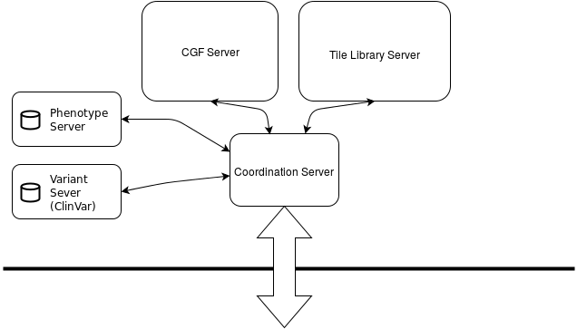

Lightning Architecture
===

This is a work-in-progress document describing the architecture
of the Lightning system.

Overview
---

Lightning is a system that allows for efficient access to
large large scale population genomic data with a focus
on clinical and research use.
The primary use of Lightning is for populations human genomic
data but this could be extended to encompass other organisms.
Genomes are stored in a compressed format that is a compromise
between size and accessibility.
Additional data data sources, such as phenotype data from
the Harvard Personal Genome Project and variant data from
the ClinVar database, are added for practical use.

The Lightning system is a combination of a conceptual way
to think about genomes (genomic tiling),
the internal representation of genomes for efficient access
(the compact genome format and auxiliary data) and the
software that manages access to the data.

This document will be focusing on the software that manages
the data.  Please refer to [Lightning Concepts](Lightning-Concepts.md)
for the description of the tiling system and
[Lightning Data](Lightning-Data.md]) for references to the
data structures used.

Architectural Overview
---

There are four main services, the compact genome tile (CGF) server,
the tile library server, the phenotype Server and the variant server.
The query coordinator is the access point where outside requests
give queries to.  The query coordinator distributes the portions of the
request that require the different services, collects results and gives
them back to the originating caller.

Below is a diagram depicting the different components:

The boxes depict a server.  Short lines denoting a communication
line between the different components.
The bold line at the bottom separates the internet from the internal
network the services sit inside.

The motivation for creating different services was to allow for
an isolation of concerns.  Each service has a specific goal that
can be decoupled from the rest of the services.  This allows for
each to be developed independently and easily swapped out or extended
if need be.

Each service can be though of as a wrapper around access to the underlying
data.  Should the separation prove to be overly complex or slow, different
services might be consolidated in the future.

Briefly, the domain of each service can be listed as:

* `Compact genome format server`: individual or population level data set queries
* `Tile library server`: raw tile sequence, tile sequence conversion and reference mapping functions
* `Phenotype server`: phenotype trait queries for individuals
* `Variant server`: variant queries as they map to tiles
* `Coordination server`: single outside end point for API requests

### Compact Genome Format (CGF) Server

The compact genome format (CGF) server provides access to the underlying
compact genome format files.  The population of data sets, stored as CGF
files, are loaded into memory for quick access.

Queries to the CGF server are restricted to questions about data sets,
tiles for individual data sets and tile concordance matching between
data sets managed by the CGF server.

### Tile Library Server

The tile library server provides access to the underlying library
sequences.  The compact genome format, in some sense, can be thought
of as vector of pointers, pointing to a library of sequences.  The
tile library server provides access to the underlying sequence
library, allowing for reconstruction of the data set sequence
or conversion to other formats.

Because raw sequence data can be large (800MiB+), the tile library
server will provide conversion utilities that can convert to other
formats, such as GFF or GVCF.  This could be done
by transfer of raw sequence and subsequent alignment out of core
but the conversion and alignment is provided by the tile library
server because of the data locality.

The tile library server also provides access to the assembly and
tag information.  The tile library server provides access
to queries that need to map tile end position
to reference genomes, such as `hg19`.

Tag sequence information is also provided by the tile library
server.

As the tile library server provides reference genome mapping functions,
the tile library server has a local copy of the reference genomes
mapped to tiles.  Note that reference genomes can be considered
as a haploid data set and do not necessarily map to the default
or most common tile at any given tile position.

### Phenotype Server

The phenotype server provides phenotype trait information
for individuals whose data sets (CGF files)
are made available in the Lightning system.

There can be multiple phenotype servers, each servicing
individual phenotype data.
Since phenotype data can be heterogeneous,
separating the phenotype servers from the rest of the components
isolates the complexity of providing an end point to the
data.
Since phenotype servers are isolated from each other and other
Lightning servers, this
also allows for addition or removal of phenotype servers
without disrupting other components.

As a prototype, the phenotype server services the `untap` database,
which provides a consolidated database of information found on
the Harvard Personal Genome Project.

### Variant Server

The variant server provides the mapping from variants
to tiles as they appear in the Lightning system.

There can be multiple variant servers, each servicing
individual variant data.
Since variant data can be heterogeneous,
separating the variant servers from the rest of the components
isolates the complexity of providing an end point to the
data.
Since variant servers are isolated from each other and other
Lightning server, this
also allows for addition or removal of variant servers
without disrupting other components.

As a prototype, the variant server provides access
and mapping to the `ClinVar` database.

### Query Coordinator Server

The query coordination server provides a uniform
interface for API access to the Lightning server
system.
Complex queries requiring coordination between
the different servers running above can use
the query coordinator to query and collect the
data for delivery.
Presumably the query coordinator server sits
on the same machine or network as the other servers,
allowing for low overhead when querying individual
components.

The query coordinator controls which
portion of the query are satisfied by each of
the other Lightning server systems.
Since each component above is conceptually
isolated from each other, the query coordinator
might need to use the result of an earlier sub-query
for the remaining query.

For example, if a query were to ask for
all individuals that have a particular variant,
the query coordinator would contact the variant
server, get a list of tiles that map to the variant
in question and then query the CGF server to find
out who in the population has the resulting
list of tiles, providing the results back
to the requester.

As another example, if a query were to ask for
the GVCF output of a data set, the query coordinator
would fetch the tile list from the CGF server,
then query the tile library server, providing
the tile list for use in the GVCF conversion,
passing on the result to the requester.

