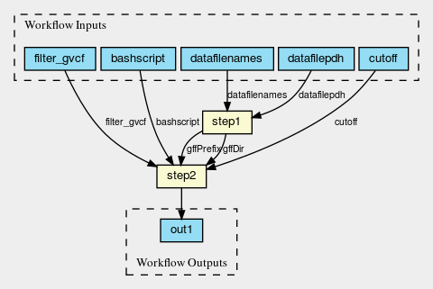
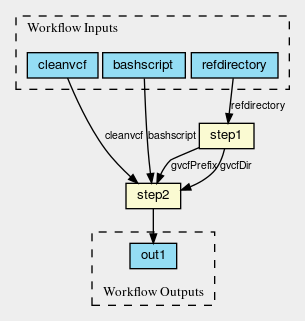
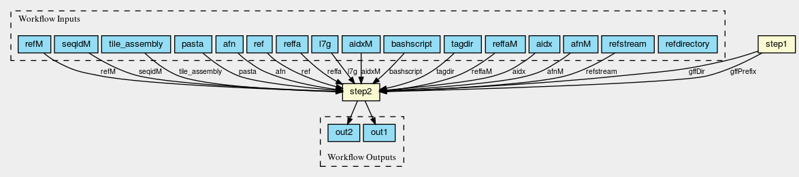
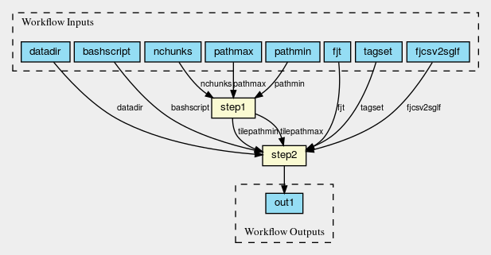
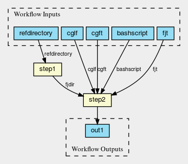

# Tiling Workflow 1.0

## Step1: Filter the GVCFs
### Brief Description:
    This step filtered the GVCF by some quality cutoff.

Input: “RAW” gVCFs (each in a different collection/project)
Output: Filtered gVCFs (all in 1 collection, per run)

### tiling_filtergvcf.cwl

### Workflow
`tiling_filtergvcf.cwl`
  - `getCollections.cwl`
  - `filter.cwl`

----

## Step2: Clean the GVCFs

### Brief Description:
    It was found that there were duplicate/overlapping calls in the GVCFs, to resolve this -- there was “cleaning” code

    Input: Filtered GVCFs
    Output: Cleaned and Filtered GVCFs

### tiling_clean_gvcf.cwl

### Workflow
`tiling_clean_gvcf.cwl`
  - `getdirs.cwl`
  - `cleangvcf.cwl`
----

## Step3:  Create the FASTJ files

### Brief Description:
    This step creates a FASTJ file per path for each GVCF.  

    Input :Cleaned and Filtered GVCFs
    Output: FASTJ for each path

### tiling_convert2fastj_gvcf.cwl

### Workflow
`tiling_convert2fastj_gvcf.cwl`
  - `getdirs.cwl`
  - `convertgvcf.cwl`

----

# Step4: Create the SGLF files
## Brief Description:
  This step creates a set of SGLF files (tile library) for a given set of FASTJ files.

### tiling_createsglf_chunk-scatter_v2.cwl

## Step4b:  “Sanity” Check the SGLF files
### Brief Description:
  Checks SGLFs for correct span formatting and no spurious characters in sequence

  Input: Set of SGLF Files
  Output: File out.txt with “ok” if all files pass the test

### sglf-sanity-check.cwl (no figure)

### Workflow
`tiling_createsglf_chunk-scatter_v2.cwl`
  - `getpaths_chunk.cwl`
  - `createsglf_chunkv2.cwl`
`merge-tilelib.cwl`

----

## Step5:  Merge the SGLF files (Tile Library Merging)
### Brief Description:
    This step creates merged all the sglf “libraries” from step4.

## merge-tilelib.cwl (no figure)

----

## Step6:  Create the CGF files
### Brief Description:
    This step creates a cgf for each FASTj file.

### tiling_convert2cgf.cwl

## Step6b:  Check the CGF Files

### Brief Description:
    This step checks the cgf to make sure the sequence derived from them matches the sequence derived from the FASTJ files.  

### Workflow
`tiling_convert2cgf.cwl`
  - `getdirs.cwl`
  - `createcgf.cwl`

  ---

## check-cgf Workflow
`validate-conversion-gvcf-cgf-chrom_workflow.cwl`
  - `gather_validate-conversion-gvcf-cgf.cwl`
  - `validate-conversion-gvcf-cgf-chrom.cwl`

----

## Step7: Create the Numpy Files

### Brief Description:
    This step is actually a two step process 1) create numpy arrays for each path from the cgf files and the sglf library  2) merge path numpy arrays into a single numpy array.  Ran this workflow on the 10 sets of ~400 cgf files.  

### Workflow
`tiling_npy-wf.cwl`
  - `tiling_create-npy.cwl`
  - `tiling_consol-npy.cwl`

----

# Tiling Workflow 1.0 (master cwl workflow)

## Step1: Filter the GVCFs
`tiling_filtergvcf.cwl`
  - `getCollections.cwl`
  - `filter.cwl`

## Step2: Clean the GVCFs
`tiling_clean_gvcf.cwl`
  - `getdirs.cwl`
  - `cleangvcf.cwl`

## Step3: Create the FASTJ files
`tiling_convert2fastj_gvcf.cwl`
  - `getdirs.cwl`
  - `convertgvcf.cwl`

## Step4: Create the SGLF files
`tiling_createsglf_chunk-scatter_v2.cwl`
  - `getpaths_chunk.cwl`
  - `createsglf_chunkv2.cwl`

## Step4a
`sglf-sanity-check.cwl`

## Step5: Merge the SGLF files (Tile Library Merging)
`merge-tilelib.cwl`

## Step6a: Create the CGF files
`tiling_convert2cgf.cwl`
  - `getdirs.cwl`
  - `createcgf.cwl`

## Step6b: check-cgf Workflow
`validate-conversion-gvcf-cgf-chrom_workflow.cwl`
  - `gather_validate-conversion-gvcf-cgf.cwl`
  - `validate-conversion-gvcf-cgf-chrom.cwl`

## Step7: Create the Numpy Files
`tiling_npy-wf.cwl`
  - `tiling_create-npy.cwl`
  - `tiling_consol-npy.cwl`
