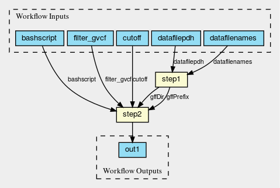

# Tiling Workflow 1.0

## Step1: Filter the GVCFs
### Brief Description:
    This step filtered the GVCF by some quality cutoff.

Input: “RAW” GVCFs (each in a different collection/project)
Output: Filtered GVCFs (all in 1 collection, per run)

### tiling_filtergvcf.cwl

### tiling_filtergvcf19.cwl

## Stats:
### Total time:
    Set1: It has runtime of 7h41m(7mqueued) and used 76d20h37m of node allocation time (240.2⨯ scaling).
    Set2: It has runtime of 4h9m(8mqueued) and used 38d21h11m of node allocation time (225.3⨯ scaling).
    Total for both sets: ~115 days or ~12 hrs in parallel

### Total cost:
    Estimated: 115 days * 24hrs * 0.11perhr (D2v3node) = $303.6
    Divide by ~4000 = 0.076 per genome

----

## Step2: Clean the GVCFs

### Brief Description:
    It was found that there were duplicate/overlapping calls in the GVCFs, to resolve this -- there was “cleaning” code

    Input: Filtered GVCFs
    Output: Cleaned and Filtered GVCFs

### tiling_clean_gvcf.cwl

## Stats:
### Total time:
    For 1 set of 454 -- It has runtime of 3h60m(12mqueued) and used 13d19h51m of node allocation time (83.0⨯ scaling).   13.8*24*0.11perhr (D2v3node)= 91.08

### Total cost:
    Estimated per genome:(91.08/454) = 0.20

----

## Step3:  Create the FASTJ files

### Brief Description:
    This step creates a FASTJ file per path for each GVCF.  

    Input :Cleaned and Filtered GVCFs
    Output: FASTJ for each path

### tiling_convert2fastj_gvcf.cwl

## Stats:
### Total time:
    For run #1
    It has runtime of 8h31m and used 41d4h10m of node allocation time (116.0⨯ scaling). (41*24+4) * 0.11 per/hr (D2v3node) =  108.68

----

# Step4: Create the SGLF files
## Brief Description:
  This step creates a set of SGLF files (tile library) for a given set of FASTJ files.

### tiling_createsglf_chunk-scatter_v2.cwl

## Stats:
### Total time:
    Set 1 - runtime of 23h27m(10mqueued) and used 82d3h52m of node allocation time (84.1⨯ scaling)
    Set 2 - runtime of 13h26m(10mqueued) and used 50d10h9m of node allocation time (90.1⨯ scaling).
    Total runtime -- 132 days 15hr on a E16s v3 (i think?) 1.17 an hr
    Total cost, estimated per genome: 0.73 per genome

## Step4b:  “Sanity” Check the SGLF files
### Brief Description:
  Checks SGLFs for correct span formatting and no spurious characters in sequence

  Input: Set of SGLF Files
  Output: File out.txt with “ok” if all files pass the test

### sglf-sanity-check.cwl (no figure)

----

## Step5:  Merge the SGLF files (Tile Library Merging)
### Brief Description:
    This step creates merged all the sglf “libraries” from step4.

## merge-tilelib.cwl (no figure)

----

## Step6:  Create the CGF files
### Brief Description:
    This step creates a cgf for each FASTj file.

### tiling_convert2cgf.cwl

## Stats
### Total time:
    It has runtime of 21h26m and used 103d1h60m of node allocation time (115.5⨯ scaling).
    Run on D11v2 0.185 per hr = 2474*0.185 = 457.69/454 = $1
    Total cost, estimated per genome: 457.69/454 = $1

## Step6b:  Check the CGF Files

### Brief Description:
    This step checks the cgf to make sure the sequence derived from them matches the sequence derived from the FASTJ files.  

----

## Step7: Create the Numpy Files

### Brief Description:
    This step is actually a two step process 1) create numpy arrays for each path from the cgf files and the sglf library  2) merge path numpy arrays into a single numpy array.  Ran this workflow on the 10 sets of ~400 cgf files.  

Input:
Output:

CWL code (master cwl workflow) run:
